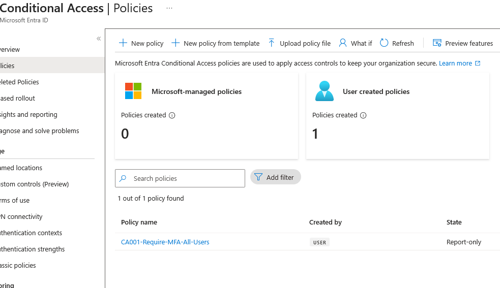
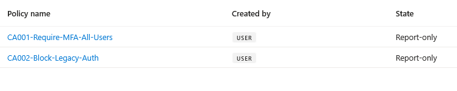
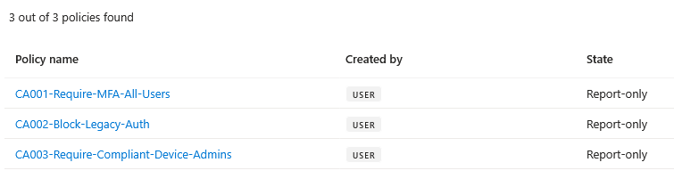
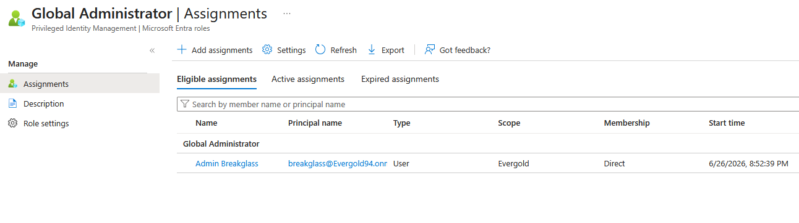

Zero Trust Identity Foundation in Microsoft Entra ID
Platform: Microsoft Entra ID (E5)  
Tools Used: Microsoft Entra ID, Conditional Access, Privileged Identity Management (PIM), Multi-Factor Authentication (MFA), Self-Service Password Reset (SSPR)  
Environment: Lab Tenant  
Date Completed: June 2026
---
Overview
This project covers building a Zero Trust identity security baseline using Microsoft Entra ID. The goal was to simulate a real enterprise identity environment by enforcing the core principles of Zero Trust: verify explicitly, use least privilege access, and assume breach. That means identity controls, Conditional Access policies, and privileged access management working together as a stack rather than a collection of standalone settings.
Zero Trust is the standard security posture for modern organizations operating in hybrid and cloud environments. Identity is the new perimeter, and this project is about locking it down the right way using the Microsoft security stack.
This is a configuration I have worked through multiple times across different environments. Each time I come away with a clearer picture of how these controls interact at scale. This write-up documents the full configuration from start to finish.
---
Why I Built This
Organizations that move to Microsoft 365 and Azure often start with Microsoft Security Defaults, which give you basic protection out of the box. The problem is Security Defaults are one size fits all and do not give you any granular control. Real enterprise environments need custom Conditional Access policies built around specific user populations, risk levels, and compliance requirements.
The goal here was to replace Security Defaults with a layered, policy-driven identity baseline that does the following:
Enforces MFA for all users through Conditional Access rather than the legacy per-user MFA approach
Blocks legacy authentication protocols that cannot support modern MFA challenges
Restricts privileged access using Just-In-Time activation through PIM
Lets users reset their own passwords without calling the helpdesk
Creates a solid foundation that can be extended with additional Zero Trust controls down the road
This is the kind of configuration you would deploy in a production M365 environment for any security-conscious organization.
---
Architecture Overview
```
Entra ID Tenant (Evergold94)
|
|-- Users
|   |-- Alex Developer       -> Developers group, MFA enabled
|   |-- Sara Manager         -> Managers group, MFA enabled
|   |-- Admin Breakglass     -> Admins group, PIM eligible for Global Admin
|
|-- Security Groups
|   |-- Admins               -> Scoped to privileged access controls
|   |-- Developers           -> Scoped to SSPR policy
|   |-- Managers             -> Scoped to standard user policies
|
|-- Conditional Access Policies
|   |-- CA001 - Require MFA for All Users
|   |-- CA002 - Block Legacy Authentication
|   |-- CA003 - Require Compliant Device for Admins
|
|-- MFA
|   |-- Per-user MFA enabled for Alex Developer and Sara Manager
|
|-- SSPR (Self-Service Password Reset)
|   |-- Enabled for Developers group, 2 authentication methods required
|
|-- Privileged Identity Management
    |-- Admin Breakglass - Eligible for Global Administrator (JIT)
```
---
Step-by-Step Configuration
Step 1: User Creation
Three test users were created to simulate a real org structure with distinct roles and access needs.
Display Name	User Principal Name	Purpose
Alex Developer	alex.developer@Evergold94.onmicrosoft.com	Simulates a developer with standard access
Sara Manager	sara.manager@Evergold94.onmicrosoft.com	Simulates a manager with standard access
Admin Breakglass	breakglass@Evergold94.onmicrosoft.com	Emergency admin account for break-glass scenarios
Each user was created via Entra ID > Users > New user > Create new user with a temporary password.
Why a Breakglass account? Break-glass accounts are emergency administrator accounts that are excluded from Conditional Access policies. The point is to make sure you always have a way into the tenant if something goes wrong with your normal admin account or a misconfigured policy. This is a real-world best practice recommended by Microsoft and something you will see in almost every mature M365 environment.

---
Step 2: Security Group Creation
Security groups were created to organize users by function. This lets you scope Conditional Access policies, SSPR, and PIM to specific user populations instead of applying everything to everyone.
Group Name	Type	Members
Admins	Security	Admin Breakglass
Developers	Security	Alex Developer
Managers	Security	Sara Manager
Groups were created via Entra ID > Groups > New group with Membership type set to Assigned.
Why groups instead of individual users in policies? Targeting groups makes everything scalable. When a new developer joins the org, you add them to the Developers group and they inherit all the right policies automatically. No need to touch the policies themselves.

---
Step 3: Disabling Security Defaults
Before creating Conditional Access policies, Security Defaults needed to be turned off. Security Defaults and Conditional Access cannot run at the same time since they conflict with each other.
Path: Entra ID > Properties > Manage security defaults > Disabled  
Reason selected: "My organization is using Conditional Access"
Turning off Security Defaults does not leave the tenant unprotected. It hands control over to the administrator so you can build something more tailored. The CA policies in the next steps replace and go beyond what Security Defaults provide.

---
Step 4: Enabling MFA for Users
Per-user MFA was enabled for Alex Developer and Sara Manager through the legacy Per-user MFA portal.
Path: Entra ID > Users > Per-user MFA
User	MFA Status
Alex Developer	Enabled
Sara Manager	Enabled
Admin Breakglass	Disabled (controlled via PIM)
Mike Hall	Disabled (tenant admin account)
In a mature Zero Trust environment, MFA enforcement lives entirely in Conditional Access rather than per-user settings. Per-user MFA is the older approach. CA001 in the next step is the modern way to do it. Both are configured here to show the contrast between legacy and current methods.

---
Step 5: Conditional Access Policy 1 - Require MFA for All Users
Policy Name: `CA001-Require-MFA-All-Users`  
State: Report-only
Setting	Value
Users	All users
Target resources	All cloud apps
Grant control	Require multifactor authentication
Policy state	Report-only
Why Report-only? In a lab environment, turning on a policy that enforces MFA on all users including your own admin account can lock you out if MFA registration is not complete. Report-only mode evaluates sign-ins and logs what would have happened without actually enforcing anything. In production you would set this to On after reviewing the logs and confirming everything looks right.
What this prevents: Without MFA, a stolen password is all an attacker needs. MFA adds a second factor they cannot satisfy even with valid credentials.

---
Step 6: Conditional Access Policy 2 - Block Legacy Authentication
Policy Name: `CA002-Block-Legacy-Auth`  
State: Report-only
Setting	Value
Users	All users
Target resources	All cloud apps
Conditions - Client apps	Exchange ActiveSync clients, Other clients
Grant control	Block access
Policy state	Report-only
Why block legacy authentication? Legacy protocols like SMTP, POP3, IMAP, and older Office clients do not support modern MFA challenges. That means even with CA001 in place, an attacker using a legacy auth client can bypass MFA entirely. Microsoft has reported that over 99% of password spray attacks use legacy authentication. Blocking it is one of the highest-impact things you can do.

---
Step 7: Conditional Access Policy 3 - Require Compliant Device for Admins
Policy Name: `CA003-Require-Compliant-Device-Admins`  
State: Report-only
Setting	Value
Users	ZT-Admins group
Target resources	All cloud apps
Grant control	Require device to be marked as compliant
Policy state	Report-only
Why require compliant devices for admins? Admin accounts are the highest-value targets in any environment. Requiring that admin sign-ins come from Intune-managed compliant devices means that even compromised admin credentials cannot be used from an unmanaged or personal device. This is where identity security and endpoint security connect, which is a core Zero Trust principle.

---
Step 8: Self-Service Password Reset (SSPR)
SSPR was configured to let users in the Developers group reset their own passwords without contacting the helpdesk.
Path: Entra ID > Protection > Password reset
Setting	Value
SSPR enabled for	Selected - Developers group
Authentication methods required	2
Methods available	Mobile app notification, Email
Require registration at sign-in	Yes
Days before re-confirmation	180
Honestly SSPR was one of the simpler things to set up in this whole project. The configuration is clean and straightforward. You pick who gets it, how many methods they need to verify with, and what those methods are. Done. The value it delivers relative to how easy it is to configure makes it a no-brainer for any org dealing with helpdesk ticket volume.
A tenant-level configuration issue came up during setup in this specific lab environment. The process and concepts are the same regardless and this would not be an issue in a properly provisioned production tenant.
---
Step 9: Privileged Identity Management (PIM)
PIM was configured to make the Admin Breakglass account eligible rather than permanently assigned for the Global Administrator role.
Path: Entra ID > Privileged Identity Management > Microsoft Entra roles > Global Administrator > Add assignments
Setting	Value
Member	Admin Breakglass
Assignment type	Eligible
Duration	1 year
Scope	Evergold (tenant-wide)
What is JIT access? Just-In-Time access means the account has no admin privileges by default. When elevated access is needed, the user activates their eligible role through PIM, provides a justification, and completes MFA. The role is granted for a limited time window and then expires automatically.
PIM was genuinely one of the more interesting things to configure in this project. The idea that you can have a Global Administrator account that carries zero standing privilege is a serious security improvement over the traditional model. Even if the account credentials are fully compromised, the attacker gets nothing elevated without also passing MFA and triggering an activation that can be monitored and alerted on. The security posture improvement relative to how simple the setup is makes PIM one of those things that should be in every M365 environment running Entra ID P2.

---
Final Verification
Component	Status
3 users created	Done
3 security groups created	Done
Security Defaults disabled	Done
MFA enabled for standard users	Done
CA001 - Require MFA All Users	Done - Report-only
CA002 - Block Legacy Auth	Done - Report-only
CA003 - Require Compliant Device for Admins	Done - Report-only
SSPR configured for Developers group	Done
PIM eligible assignment for Breakglass account	Done
---
What I Learned
Security Defaults vs. Conditional Access - Security Defaults are fine for small organizations that need basic protection fast. But they are too rigid for anything enterprise-grade. Understanding why they conflict with CA policies and what you are trading off when you disable them is something that clicks a lot better when you actually do it versus just reading about it.
CA policies layer on top of each other - CA001 enforces MFA but CA002 is what makes CA001 actually meaningful by closing the legacy auth bypass. CA003 then adds device health as a requirement for the highest-risk accounts. Each policy builds on the last and the stack only works properly when all three are in place.
Report-only mode is really useful - Deploying CA policies in Report-only first and reviewing the sign-in logs before enforcing them is a habit worth building. It prevents accidental lockouts and gives you real data on how a policy will behave before it goes live.
PIM changes how you think about admin access - Before working with PIM it is easy to think of admin roles as something you either have or you do not. PIM introduces the eligible state which shifts the whole security model. Standing privilege becomes the exception rather than the rule and that is a big deal for reducing attack surface.
SSPR is simple and the payoff is immediate - The configuration takes minutes. The reduction in helpdesk tickets and the improvement in user experience make it one of the easiest wins in the M365 security stack.
---
